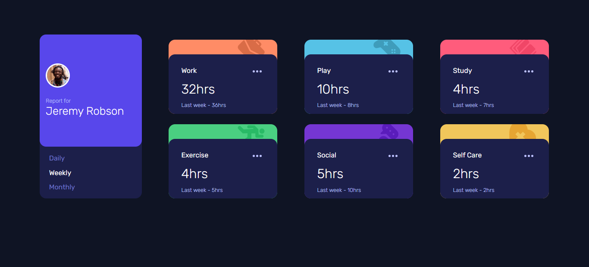
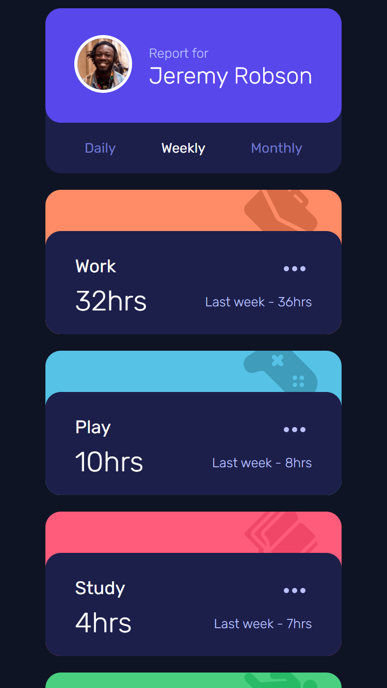

# Frontend Mentor - Time tracking dashboard solution

This is a solution to the [Time tracking dashboard challenge on Frontend Mentor](https://www.frontendmentor.io/challenges/time-tracking-dashboard-UIQ7167Jw). 

## Overview

### The challenge

Users should be able to:

- View the optimal layout for the site depending on their device's screen size
- See hover states for all interactive elements on the page
- Switch between viewing Daily, Weekly, and Monthly stats

### Screenshots

|||

## My process

### Built with

- Pure HTML, CSS and JS
- Mobile-first workflow
- Flexbox
- CSS Grid
- Fetch API

### Note: It's important to use LiveServer or similar to run this project so that the data is loaded correctly.